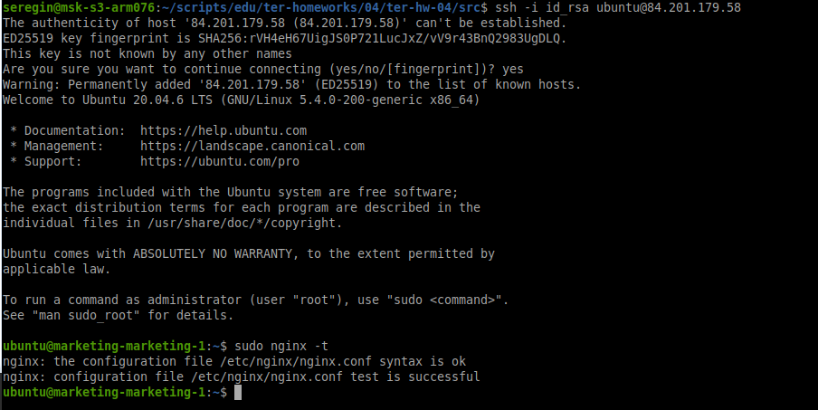
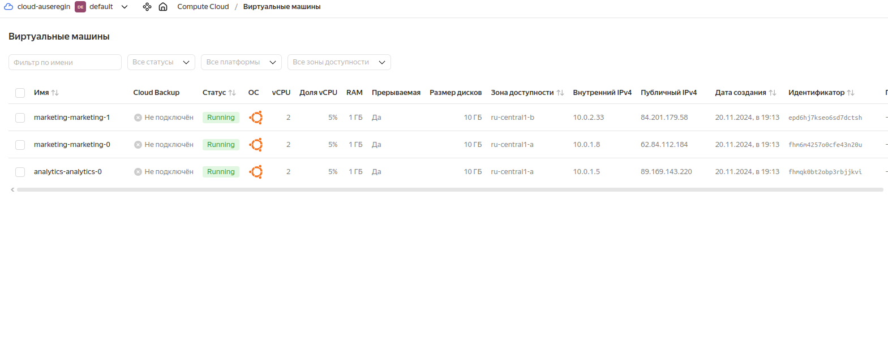
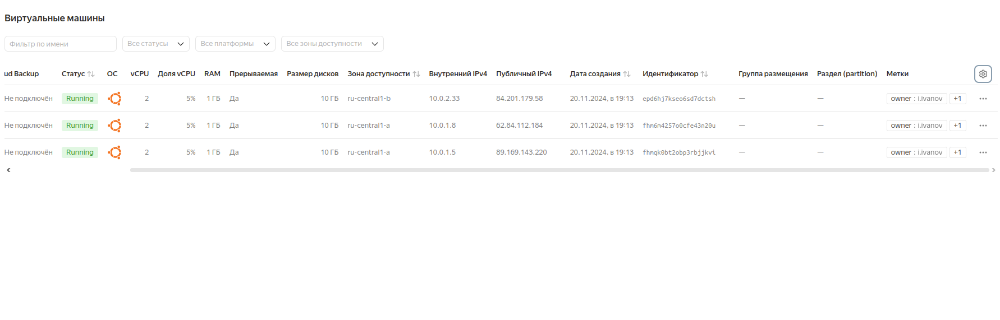
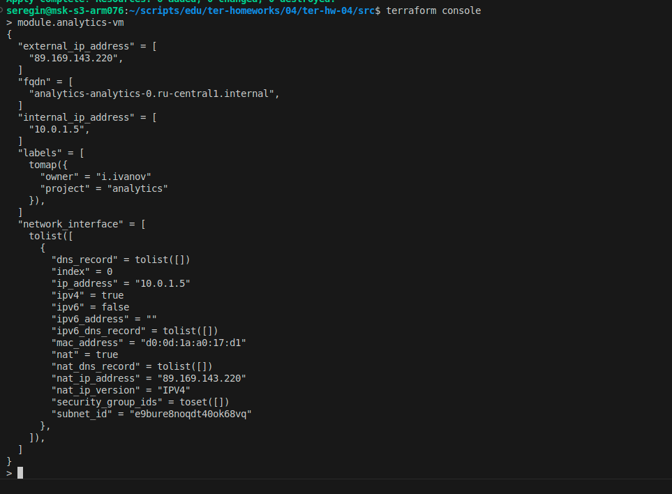
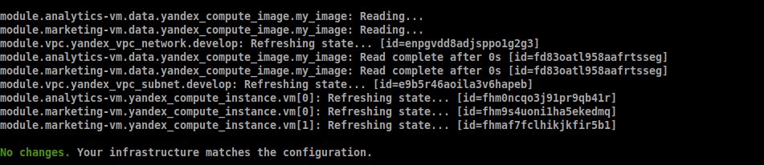
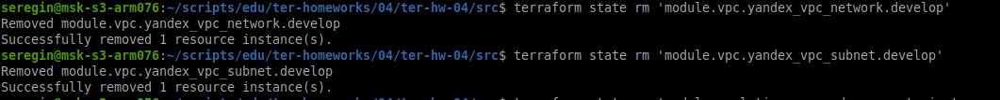
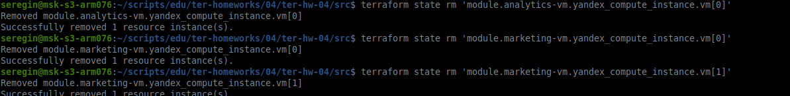
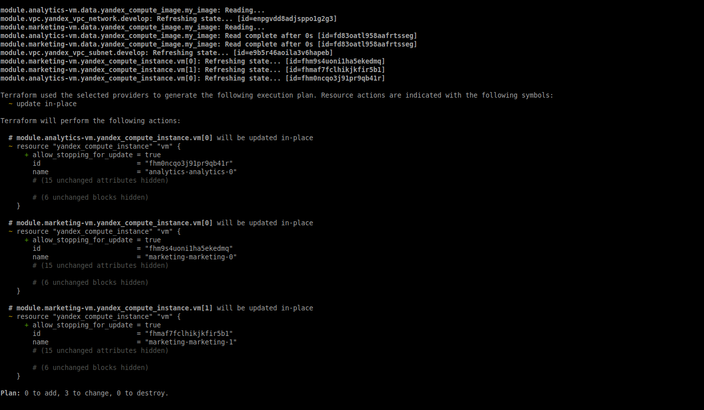

# Домашнее задание к занятию «Продвинутые методы работы с Terraform»

### Цели задания

1. Научиться использовать модули.
2. Отработать операции state.
3. Закрепить пройденный материал.


### Чек-лист готовности к домашнему заданию

1. Зарегистрирован аккаунт в Yandex Cloud. Использован промокод на грант.
2. Установлен инструмент Yandex CLI.
3. Исходный код для выполнения задания расположен в директории [**04/src**](https://github.com/netology-code/ter-homeworks/tree/main/04/src).
4. Любые ВМ, использованные при выполнении задания, должны быть прерываемыми, для экономии средств.

------
### Внимание!! Обязательно предоставляем на проверку получившийся код в виде ссылки на ваш github-репозиторий!
Убедитесь что ваша версия **Terraform** ~>1.8.4
Пишем красивый код, хардкод значения не допустимы!
------

### Задание 1

1. Возьмите из [демонстрации к лекции готовый код](https://github.com/netology-code/ter-homeworks/tree/main/04/demonstration1) для создания с помощью двух вызовов remote-модуля -> двух ВМ, относящихся к разным проектам(marketing и analytics) используйте labels для обозначения принадлежности.  В файле cloud-init.yml необходимо использовать переменную для ssh-ключа вместо хардкода. Передайте ssh-ключ в функцию template_file в блоке vars ={} .
Воспользуйтесь [**примером**](https://grantorchard.com/dynamic-cloudinit-content-with-terraform-file-templates/). Обратите внимание, что ssh-authorized-keys принимает в себя список, а не строку.
3. Добавьте в файл cloud-init.yml установку nginx.
> 4. Предоставьте скриншот подключения к консоли и вывод команды ```sudo nginx -t```



> скриншот консоли ВМ yandex cloud с их метками.





>  Откройте terraform console и предоставьте скриншот содержимого модуля. Пример: > module.marketing_vm



------
В случае использования MacOS вы получите ошибку "Incompatible provider version" . В этом случае скачайте remote модуль локально и поправьте в нем версию template провайдера на более старую.
------

### Задание 2

1. Напишите локальный модуль vpc, который будет создавать 2 ресурса: **одну** сеть и **одну** подсеть в зоне, объявленной при вызове модуля, например: ```ru-central1-a```.
2. Вы должны передать в модуль переменные с названием сети, zone и v4_cidr_blocks.
3. Модуль должен возвращать в root module с помощью output информацию о yandex_vpc_subnet. Пришлите скриншот информации из terraform console о своем модуле. Пример: > module.vpc_dev  
4. Замените ресурсы yandex_vpc_network и yandex_vpc_subnet созданным модулем. Не забудьте передать необходимые параметры сети из модуля vpc в модуль с виртуальной машиной.
> 5. Сгенерируйте документацию к модулю с помощью terraform-docs.

<!-- BEGIN_TF_DOCS -->
## Requirements

| Name | Version |
|------|---------|
| <a name="requirement_terraform"></a> [terraform](#requirement\_terraform) | ~>1.8.4 |

## Providers

No providers.

## Modules

| Name | Source | Version |
|------|--------|---------|
| <a name="module_analytics-vm"></a> [analytics-vm](#module\_analytics-vm) | git::https://github.com/udjin10/yandex_compute_instance.git | main |
| <a name="module_marketing-vm"></a> [marketing-vm](#module\_marketing-vm) | git::https://github.com/udjin10/yandex_compute_instance.git | main |
| <a name="module_vpc"></a> [vpc](#module\_vpc) | ./vpc | n/a |

## Resources

No resources.

## Inputs

| Name | Description | Type | Default | Required |
|------|-------------|------|---------|:--------:|
| <a name="input_cloud_id"></a> [cloud\_id](#input\_cloud\_id) | n/a | `string` | n/a | yes |
| <a name="input_default_cidr"></a> [default\_cidr](#input\_default\_cidr) | https://cloud.yandex.ru/docs/vpc/operations/subnet-create | `list(string)` | <pre>[<br/>  "10.0.1.0/24"<br/>]</pre> | no |
| <a name="input_default_zone"></a> [default\_zone](#input\_default\_zone) | https://cloud.yandex.ru/docs/overview/concepts/geo-scope | `string` | `"ru-central1-a"` | no |
| <a name="input_each_subnet"></a> [each\_subnet](#input\_each\_subnet) | n/a | <pre>map(object({<br/>    name = string<br/>    zone = string<br/>    cidr = list(string)<br/>  }))</pre> | <pre>{<br/>  "subnet-a": {<br/>    "cidr": [<br/>      "10.0.1.0/24"<br/>    ],<br/>    "name": "develop-ru-central1-a",<br/>    "zone": "ru-central1-a"<br/>  },<br/>  "subnet-b": {<br/>    "cidr": [<br/>      "10.0.2.0/24"<br/>    ],<br/>    "name": "develop-ru-central1-b",<br/>    "zone": "ru-central1-b"<br/>  }<br/>}</pre> | no |
| <a name="input_each_vm"></a> [each\_vm](#input\_each\_vm) | n/a | <pre>map(object({<br/>      name = string<br/>      owner = string<br/>      subnet_zones = list(string)<br/>      count = number<br/>      cpu = number<br/>      ram = number<br/>      disk_volume = number<br/>      core_fraction = number <br/>      image = string<br/>      scheduling_policy = bool<br/>      platform_id = string<br/>      nat = bool<br/>    }))</pre> | <pre>{<br/>  "analytics": {<br/>    "core_fraction": 5,<br/>    "count": 1,<br/>    "cpu": 2,<br/>    "disk_volume": 20,<br/>    "image": "ubuntu-2004-lts",<br/>    "name": "analytics",<br/>    "nat": true,<br/>    "owner": "i.ivanov",<br/>    "platform_id": "standard-v1",<br/>    "ram": 2,<br/>    "scheduling_policy": "true",<br/>    "subnet_zones": [<br/>      "ru-central1-a"<br/>    ]<br/>  },<br/>  "marketing": {<br/>    "core_fraction": 5,<br/>    "count": 2,<br/>    "cpu": 2,<br/>    "disk_volume": 10,<br/>    "image": "ubuntu-2004-lts",<br/>    "name": "marketing",<br/>    "nat": true,<br/>    "owner": "i.ivanov",<br/>    "platform_id": "standard-v1",<br/>    "ram": 2,<br/>    "scheduling_policy": "true",<br/>    "subnet_zones": [<br/>      "ru-central1-a",<br/>      "ru-central1-b"<br/>    ]<br/>  }<br/>}</pre> | no |
| <a name="input_folder_id"></a> [folder\_id](#input\_folder\_id) | n/a | `string` | n/a | yes |
| <a name="input_token"></a> [token](#input\_token) | ##cloud vars | `string` | n/a | yes |
| <a name="input_vpc_name"></a> [vpc\_name](#input\_vpc\_name) | n/a | `string` | `"develop"` | no |

## Outputs

No outputs.
<!-- END_TF_DOCS -->

Пример вызова


```
module "vpc_dev" {
  source       = "./vpc"
  env_name     = "develop"
  zone = "ru-central1-a"
  cidr = "10.0.1.0/24"
}
```

### Задание 3
> 1. Выведите список ресурсов в стейте.



2. Полностью удалите из стейта модуль vpc.



3. Полностью удалите из стейта модуль vm.



4. Импортируйте всё обратно. 

> Проверьте terraform plan. Значимых(!!) изменений быть не должно.
> Приложите список выполненных команд и скриншоты процессы.




## Дополнительные задания (со звёздочкой*)

**Настоятельно рекомендуем выполнять все задания со звёздочкой.**   Они помогут глубже разобраться в материале.   
Задания со звёздочкой дополнительные, не обязательные к выполнению и никак не повлияют на получение вами зачёта по этому домашнему заданию. 


### Доп задания не делал :(
